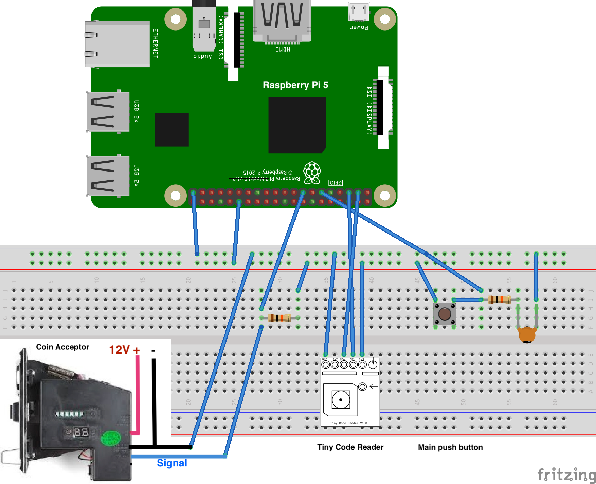

# change-o-matic
Kaspa Coin Machine. Turn that loose change into digital gold.


## Install
### Wiring Diagram
#### Ingridients
* 2 x 10kΩ Resistors
* 1 x 10µF Ceramic Capacitor (106)
* 1 x Raspberry Pi 5
* 1 x Tiny Code Reader (by Useful Sensors)
* 1 x 12V Power source
* 1 x 5V USB-C Power source 

#### Breadboard layout


* The Raspberry Pi and the Coin Acceptor use different power sources (12V and 5V respectively). 
* In the future I will use a single power source, but for now I only connect their grounds, to receive the Coin Acceptor signal.


### UI 

* cd ui
 
* npm install`

* Set the IP address of the Raspberry PI (where the python script is running) in `App.tsx`

### Server

* cd server
* pip install <module-name>
  * See the list below

## Run

* cd ui

* npm start


* cd server

* python3 click-socket.py

``` The python script will create a websocket running at `ws://0.0.0.0:8765`.
The ui will connect to that server's IP from the browser.```

* Open http://192.168.10.10:3000/ (use the Raspberry Pi's IP-Address)

## More Info

  The list of python modules to install:

  |Package    |        Version|
  |-----------|---------------|
  |annotated-t|ypes    0.7.0|
  |anyio      |        4.8.0|
  |base58     |        2.1.1|
  |bech32     |        1.1.0|
  |certifi    |        2025.1.31|
  |charset-nor|malizer 3.4.1|
  |click      |        8.1.8|
  |colorzero  |        2.0|
  |ecdsa      |        0.19.0|
  |fastapi    |        0.115.11|
  |gpio       |        1.0.0|
  |gpiozero   |        2.0.1|
  |grpcio     |        1.70.0|
  |grpcio-tool|s       1.70.0|
  |h11        |        0.14.0|
  |idna       |        3.10|
  |kaspy      |        0.0.13|
  |lgpio      |        0.2.2.0|
  |pigpio     |        1.78|
  |pip        |        23.0.1|
  |protobuf   |        5.29.3|
  |pydantic   |        2.10.6|
  |pydantic_co|re      2.27.2|
  |requests   |        2.32.3|
  |setuptools |        66.1.1|
  |six        |        1.17.0|
  |smbus2     |        0.5.0|
  |sniffio    |        1.3.1|
  |sockets    |        1.0.0|
  |starlette  |        0.46.0|
  |typing_exte|nsions  4.12.2|
  |urllib3    |        2.3.0|
  |uvicorn    |        0.34.0|
  |websockets |        15.0|


### TODO, known issues, limitations
* There's an issue with the conversion function 
* The monitor doesn't work properly at the moment. Failed transactions are registered in a separate file, but there's no active resubmission process after 10 minutes.
* I tried to come up with a full python application, but resolved to use the examples from `wasm` folder as a basis for my sub-processes
* 
